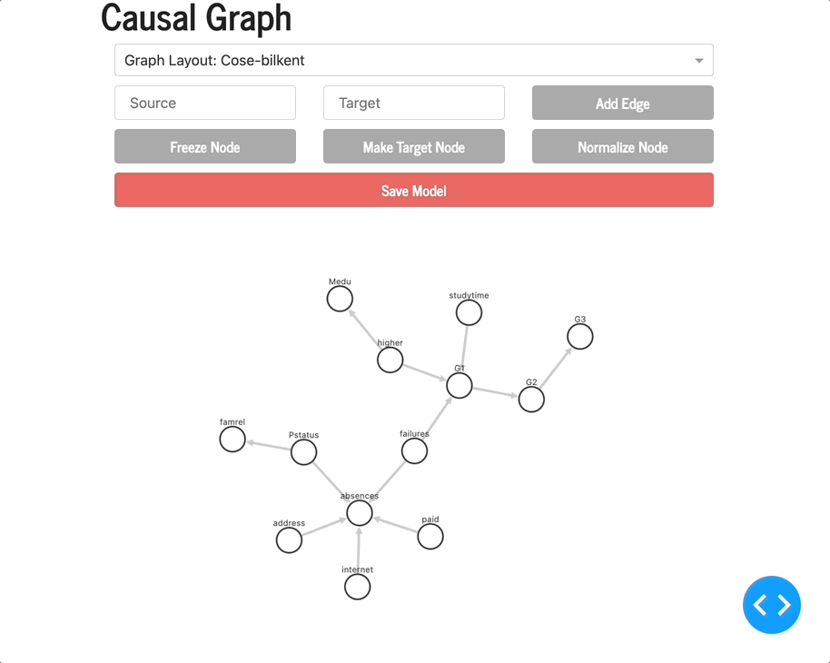

# Causal_Graph_Dash
[mainApp.py](mainApp.py) is the driver file. Run the file and play around with the application on your local host.

## Functionality
```
From the dropdown, you can choose graph configurations or simply move individual nodes.
```


```
Nodes can be frozen, a target node, or a normal node. You can change the value of individual nodes by clicking the node and then clicking the respective button. Normal nodes will be transparent, frozen nodes are black and the target node is red. 
```

