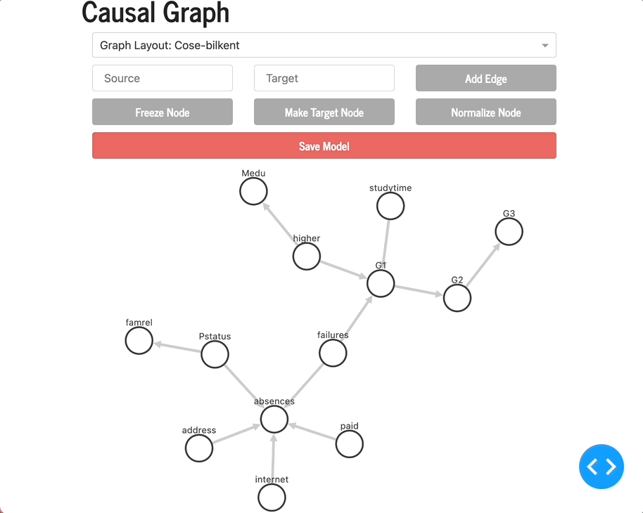

# Causal_Graph_Dash
[mainApp.py](mainApp.py) is the driver file. Run the file and play around with the application on your local host.

From the dropdown, you can choose graph configurations or simply move individual nodes.

