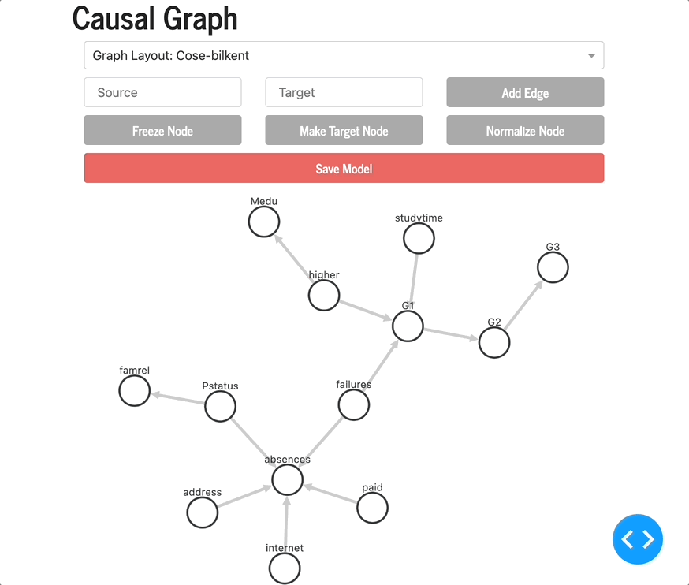

# Causal_Graph_Dash
[mainApp.py](mainApp.py) is the driver file. Run the file and play around with the application on your local host.

## Functionality

1) From the dropdown, you can choose graph configurations or simply move individual nodes.

2) Nodes can be frozen, a target node, or a normal node. You can change the value of individual nodes by clicking the node and then clicking the respective button. Normal nodes will be transparent, frozen nodes are red and the target node is black. 

3) Edges can be added from one node to another node. Input valid node names in the input boxes from node to node. This will add a uni-directional edge.

4) Edges can be removed by clicking an edge and clicking remove from the popup.

